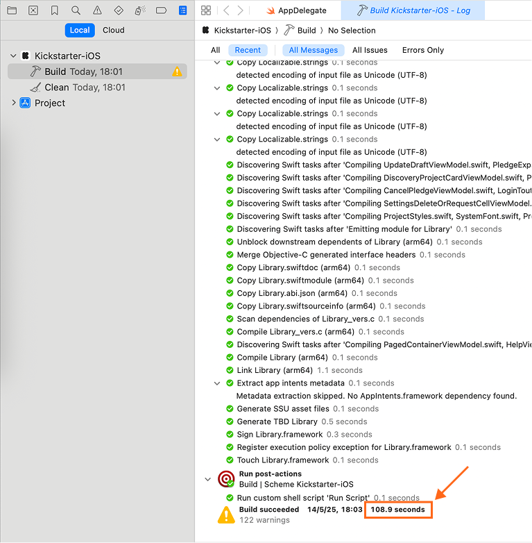

[< Knowledge Base](README.md)

# ✍🏼 Case Study: Using XCCache in Kickstarter iOS Project

Let’s try this xccache tool with the [Kickstarter iOS](https://github.com/kickstarter/ios-oss) project.

I forked the project to [trinhngocthuyen/kickstarter-ios](https://github.com/trinhngocthuyen/kickstarter-ios). Check out the branch [try/xccache](https://github.com/trinhngocthuyen/kickstarter-ios/tree/try/xccache) for the detailed integration.

Following are the steps needed for the integration.

#### Step 1. Add `xccache` to Gemfile

Then, run `bundle install` to have it installed.

#### Step 2. [Optional] Using existing remote cache

Specify the git repo for the cache in [`xccache.yml`](https://github.com/trinhngocthuyen/kickstarter-ios/blob/try/xccache/xccache.yml).

```yaml
remote:
  default:
    git: https://github.com/trinhngocthuyen/.cache.git
```

Then, pull the cache from the given repo:

```bash
bundle exec xccache remote pull
```

Now, the cache should be available in `~/.xccache/debug`.
```
$  tree ~/.xccache/debug -L 2

/Users/thuyen/.xccache/debug
├── Alamofire
│   └── Alamofire-513364f8.xcframework
├── AlamofireImage
│   └── AlamofireImage-1eaf3b6.xcframework
├── Apollo
│   └── Apollo-5db23797b.xcframework
├── ApolloAPI
│   └── ApolloAPI-5db23797b.xcframework
├── ApolloUtils
│   └── ApolloUtils-5db23797b.xcframework
├── AppboyKit
│   └── AppboyKit-a3511ca.xcframework
├── AppboySegment
│   └── AppboySegment-dc659b7.xcframework
├── AppboyUI
│   └── AppboyUI-a3511ca.xcframework
```

#### Step 3. Run `bundle exec xccache` to integrate the cache

There are some highlighting changes as follows:

- A new file: [`xccache.lock`](https://github.com/trinhngocthuyen/kickstarter-ios/blob/try/xccache/xccache.lock) that captures the dependencies in the project.
- Changes in xcodeproj files (see: [here](https://github.com/trinhngocthuyen/kickstarter-ios/commit/7520c590e067d08661bc985a035e1a5576ab7208#diff-9cb89939ff9e9815f0bcf171699ed9e3090ae718529ada6e606566b32cdd42adR116)):
    - A special package (xccache/packages/umbrella) is added
    - Packages and their product dependencies are removed from xcodeproj.
    Don’t worry, you can still use those products though.

#### Step 4. Trigger “Resolve Package Versions”

Tip: You should trigger this after running xccache command because Xcode doesn’t auto-resolve dependencies upon changes in xccache’s package manifest.

#### Step 5. Try a clean build

And observe the build time when having cache.
The observed buid time on my Macbook Air (M1, 2020) is just nearly **2 minutes** 🎉.


