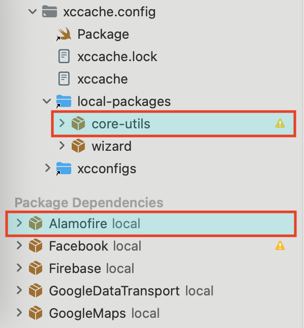
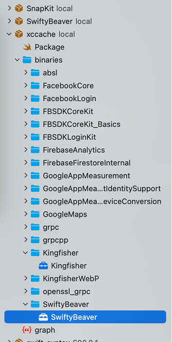

[< Knowledge Base](README.md)

# 🚀 Getting Started

<details>
<summary>Table of Contents</summary>
<ul>
<li><a href="#quick-start">Quick Start</a></li>
<li><a href="#understanding-the-tool">Understanding the Tool</a></li>
<li>
  <a href="#working-with-cache">Working With Cache</a>
  <ul>
  <li><a href="#building-cache">Building Cache</a></li>
  <li><a href="#using-cache">Using Cache</a></li>
  <li><a href="#viewing-cachemap-visualization">Viewing Cachemap Visualization</a></li>
  <li><a href="#switching-between-binary-and-source-code">Switching Between Binary and Source Code</a></li>
  <li><a href="#rolling-back-cache">Rolling Back Cache</a></li>
  <li><a href="#multiplatform-cache">Multiplatform Cache</a></li>
  <li><a href="#per-configuration-cache">Per-Configuration Cache</a></li>
  <li><a href="#sharing-remote-cache">Sharing Remote Cache</a></li>
  <li><a href="#sharing-remote-cache">Sharing Remote Cache</a></li>
  </ul>
</li>
<li>
  <a href="#working-with-swift-packages">Working With Swift Packages</a>
  <ul>
  <li><a href="#building-a-swift-package-target">Building a Swift Package Target</a></li>
  </ul>
</li>
<li>
  <a href="#managing-dependencies">Managing Dependencies</a>
  <ul>
  <li><a href="#adding-a-dependency">Adding a Dependency</a></li>
  <li><a href="#removing-a-dependency">Removing a Dependency</a></li>
  </ul>
</li>
<li><a href="#configuration">Configuration</a></li>
</ul>
</details>

## Quick Start

[✍🏼 Case Study: Using XCCache in Kickstarter iOS Project](case-study-kickstarter.md) ← Read here.

Simply run `xccache` under the root directory of the project. Then, you should see:
- **`xccache.lock`**: containing the info about packages in the project alongside the products being used. You're recommended to track this file in git.
- The `xccache` directory: containing build intermediates for the integration. This directory is similar to the `Pods` directory (in CocoaPods). Do NOT remove this directory. Instead, please ignore it from git.

If you see product dependencies of a Swift package being removed from the *Link Binary With Libraries* section, it is expected.\
In return, this plugin adds another `<Target>.xccache` product which includes your product dependencies.


Also, you may notice that all packages turn into local packages. This is perfectly normal as the tool creates special packages called *proxy packages* to manipulate cache of a package.



## Understanding the Tool
Read the overview: [here](overview.md).

Following are some docs about what happens under the hood:
- [Packaging as an xcframework](under-the-hood/packaging-as-xcframework.md)
- [Ensuring `Bundle.module` When Accessing Resources](under-the-hood/ensuring-bundle-module.md)
- [Macro as Binary](under-the-hood/macro-as-binary.md)

## Working With Cache

> [!TIP]
> Use the `--help` option in the CLI to explore available (sub)commands and their supported options/flags.

### Building Cache

To build cache of Swift packages, run `xccache build`.

By default, the tool only builds cache-missed targets. To build specify targets, specify them in the arguments, for example:
```sh
xccache build SwiftyBeaver SDWebImage
```
The prebuilt xcframeworks are available under `xccache/binaries`, following the structure as below:
```
xccache /-- binaries /-- SwiftyBeaver /-- SwiftyBeaver-<checksum>.xcframework
                                      |-- SwiftyBeaver.xcframework
```
To build dependencies if cache-missed, use the `--recursive` option. For example, to build cache of `FirebaseCrashlytics` (including its dependencies):
```sh
xccache build FirebaseCrashlytics --recursive
```

### Using Cache
Run `xccache use` or simply `xccache` to integrate cache to the project. Note that cache, after being built with `xccache build`, is automatically integrated to the project. You don't need to run `xccache use` in this case.

In the Package Dependencies section in Xcode, you should notice a special package call `xccache`.
The `binaries` directory of this package reflects the cache being used. For example, in the following image, `SwiftyBeaver` is integrated as binary.



In Xcode build log, you should see xcframeworks of the cache-hit targets being processed by Xcode.


### Viewing Cachemap Visualization

Whenever cache is integrated into your project (via `xccache`, `xccache use`, or `xccache build`), the tool generates an html (at `xccache/cachemap.html`) that visualizes the cache dependencies.\
Example: 👉 [ex-viz/cachemap](https://trinhngocthuyen.com/xccache/ex-viz/cachemap).

Open this html in your browser to better understand the depenencies in your project.
<a href="https://trinhngocthuyen.com/xccache/ex-viz/cachemap" target="_blank"></a>

### Switching Between Binary and Source Code

By default, the tool attemtps to use cache if exists. In case you want to force-switch to source mode for specific targets, there are a few approaches you may consider:

(1) Run `xccache off <targets>` (ex. `xccache off DebugKit ResourceKit`).\
Note that the preferences set by this command is not persistent. This means, the next time you run `xccache`, those targets will not be remembered; cache will be integrated if exists.

(2) If you're looking for a persistent preferences, consider adding them to the [`ignore`](configuration.md#ignore) list in the configuration file.

(3) Or, you can simply just delete the cache, ex. `rm -rf ~/.xccache/debug/DebugKit`.

> [!IMPORTANT]
> After running any xccache command, remember to trigger resolving package versions again (File -> Packages -> Resolve Package Versions). Xcode doesn't automatically reload packages upon changes.

### Rolling Back Cache

Run `xccache rollback`. This returns the project to the original state where product dependencies are specified in the *Link Binary With Libraries* section and `<Target>.xccache` is removed from this section.
> [!WARNING]
> Well, you're advised not to use this action if not necessary.\
> If you want to use source code entirely, consider *purging the cache* (`xccache cache clean --all`) instead.

### Multiplatform Cache

An xcframework can include slices for multiple platforms. Use the `--sdk` option to specify the sdk (iphonesimulator, iphoneos, etc.) to use. If not specified, it uses the [`default_sdk`](configuration.md#default_sdk) configuration in the config if exist. Otherwise, it defaults to `iphonesimulator`.

When building cache, the tool **merges existing slices with the newly created** to reduce unnecessary builds for multiplatform support. This behavior is controlled by the `--merge-slices` flag (default: `true`). To disable it, ie. replacing the existing xcframework if exists, specify `--no-merge-slices`.

```sh
xccache build SwiftyBeaver --sdk=iphonesimulator
xccache build SwiftyBeaver --sdk=iphoneos # <-- here, xcframework contains both sdks: iphonesimulator and iphoneos

xccache build SwiftyBeaver --sdk=macos --no-merge-slices # <-- here, xcframework contains only macos sdk
```

### Per-Configuration Cache

Cache of different build configurations (debug/release) is hosted in separate directories `~/.xccache/<configuration>`. The build configuration is defaulted to `debug`. To specify a different build configuration, use the `--config` argument.
```sh
xccache build SwiftyBeaver --config=release
xccache --config=release
```

### Sharing Remote Cache
Cache can be shared among team with remote cache, using Git or S3.
```sh
xccache remote pull # <-- pull cache
xccache remote push # <-- push cache
```

Refer to the [remote configuration](configuration.md#remote) for the setup.

## Working With Swift Packages
### Building a Swift Package Target

Packaging a Swift package target as binary is not as easy as it seems, which involves several steps. This tool offers a convenient way to build such a target into an xcframework with just only one step. Check out build options (ex. configuration, sdk, etc.) with `--help`.
```sh
xccache pkg build <Target>
```

## Managing Dependencies
### Adding a Dependency

To add a new package, or new product dependencies (in the *Link Binary With Libraries* section), you can just add it the way you usually do (via Xcode), then just run `xccache` again.
After that, you should see the changes reflected in xccache.lock.


Alternatively, you can directly modify the lockfile with the changes above, and run `xccache`. This way, you can avoid modifying the xcodeproj file.

### Removing a Dependency

Just directly update the lockfile:
- Remove it from the dependencies section
- Remove it from the packages section if not in use

```
  "dependencies": {
    "EX": [
      "Moya/Moya",
      "SwiftyBeaver/SwiftyBeaver", // <-- Remove this if not in use
    ]
  },
  "packages": [
    { // <-- Remove this if not in use
      "repositoryURL": "https://github.com/SwiftyBeaver/SwiftyBeaver",
      "requirement": {
        "kind": "upToNextMajorVersion",
        "minimumVersion": "2.1.1"
      }
    }
  ]
```

## Configuration
Check out this doc: [Configuration](configuration.md)
