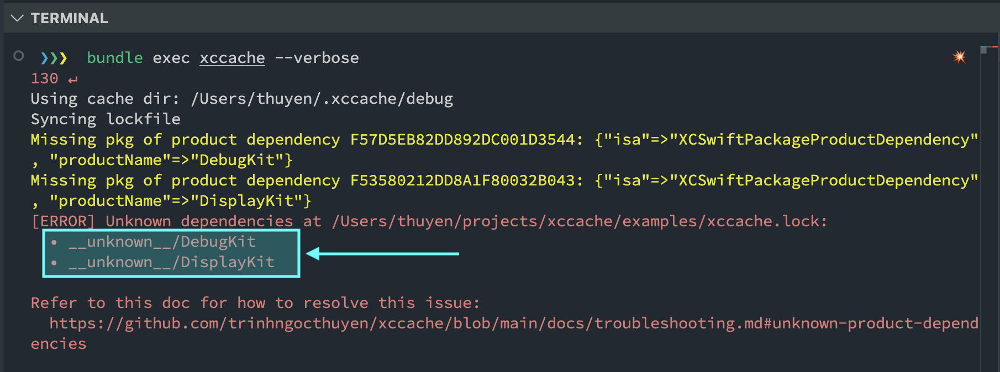

[< Knowledge Base](README.md)

# 🩺 Troubleshooting

### Unknown Product Dependencies



If you encountered this issue, it's because there are some product dependencies that the tool failed to infer their packages. This case is likely to happen when having **local packages** that were not properly added to the project. Below is the instructions to resolve this issue (once only).

After seeing this error, you should see `__unknown__/<Product>` (ex. `__unknown__/DebugKit`) in the lockfile (xccache.lock).
```json
"EX.xcodeproj": {
  "packages": [
  ],
  "dependencies": {
    "EX": [
      "__unknown__/DebugKit" // <-- HERE
    ]
  }
}
```
This mean, the tool cannot infer the package of `DebugKit`. So, what you need to do in this lockfile is:

(1) Specify the package of that unknown product.
```json
"EX.xcodeproj": {
  "packages": [
    {
      "path_from_root": "LocalPackages/core-utils" // <-- HERE
    }
  ]
}
```

(2) Then, replace the `__unknown__` in the dependencies by the package slug (ex. changing `__unknown__/DebugKit` to `core-utils/DebugKit`).

```json
"EX.xcodeproj": {
  "packages": [
    {
      "path_from_root": "LocalPackages/core-utils" // <-- HERE
    }
  ],
  "dependencies": {
    "EX": [
      "core-utils/DebugKit" // <-- HERE
    ]
  }
}
```

(3) After that, run the xccache workflow again.
