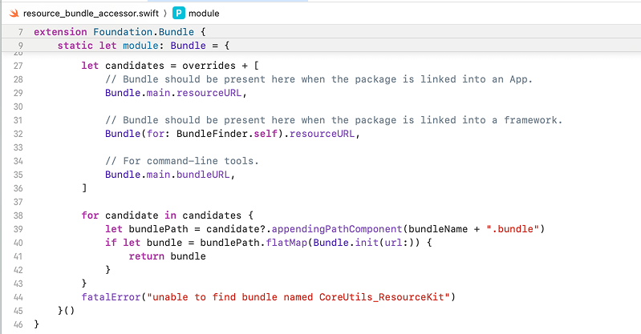
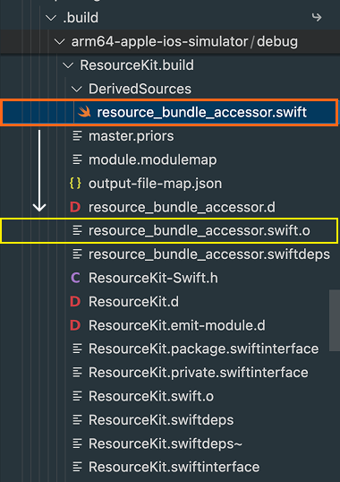
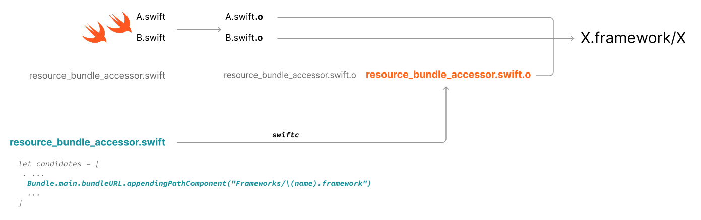

[< Knowledge Base](../README.md)

# Under the Hood: Ensuring `Bundle.module` When Accessing Resources

### Accessing Resources in Code
If a target includes resources, Xcode creates a resource bundle, which can be accessed using `Bundle.module`. This resource bundle is then copied to the app bundle:
```
App.app
  |-- App (binary)
  |-- <Pkg>_<Target>.bundle
```

> [!IMPORTANT]
> You are recommended to always use `Bundle.module` to access resources, and not make assumptions about the exact location of the resource bundle.\
> See: https://developer.apple.com/documentation/xcode/bundling-resources-with-a-swift-package#Access-a-resource-in-code

### How `Bundle.module` is Accessible

For targets having resources, Xcode or SPM build system generates an internal code for the `Bundle.module` extension. More about SPM implementation for this: [read here](https://github.com/swiftlang/swift-evolution/blob/main/proposals/0271-package-manager-resources.md#runtime-access-to-resources-bundle).

In Xcode, you can jump-to-definition on `Bundle.module` to see the generated code in a file called `resource_bundle_accessor.swift`. This file is later compiled (into an `.o` file) and merged into the library binary, along with other `.o` files.



With SPM (using `swift build`), you should see the generated source in `.build/debug/<Target>.build/DerivedSources` as in the following image:



### Resource Bundle Inside xcframework
With xccache, we want this resource bundle to reside inside the xcframework for convenience. However, when integrating this xcframework as a binary target. The app bundle structure looks like this:
```
App.app
  |-- App (binary)
  |-- Frameworks
        |-- <Target>.framework
              |-- <Target> (binary)
              |-- <Pkg>_<Target>.bundle
```

`Bundle.module` can no longer detect the resource bundle. Note that the framework binary under `Frameworks/<Target>.framework/<Target>` is codeless. So, `Bundle(for: BundleFinder.self)` does not work either.

### Workaround: Overriding Bundle Lookup Logic
A workaround for this problem is to override the lookup logic. Before combining `.o` files into the framework binary (with `libtool`), we overwrite the object file `resource_bundle_accessor.swift.o` in the build directory.
This can be done by:
- First generating the source with the [additional bundle lookup](/lib/xccache/assets/templates/resource_bundle_accessor.swift.template#L13)
- Compiling this file with `swiftc`, for example:
```sh
swiftc -emit-library \
  -module-name Foo \
  -target arm64-apple-ios-simulator \
  -sdk <path/to/iPhoneSimulator.sdk> \
  -o <path/to/resource_bundle_accessor.swift.o> \
  resource_bundle_accessor.swift
```



The same logic applies to Objective-C, ie. generating `resource_bundle_accessor.m` and compiling it into `resource_bundle_accessor.m.o` using `clang`.
