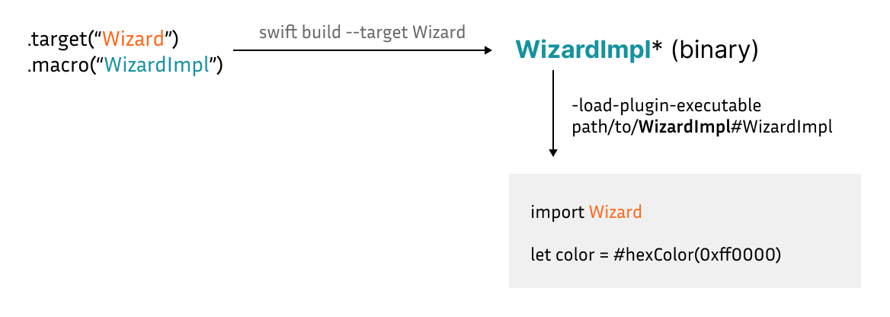

[< Knowledge Base](../README.md)

# Under the Hood: Macro as Binary

This technique was inspired by the approach mentioned in [this blog post](https://www.polpiella.dev/binary-swift-macros).

Consider the following usage where `#hexColor` is the macro and `Wizard` is its module.

```swift
import Wizard

let color = #hexColor(0xff0000)
```

Such a macro consists of two targets:
- A macro target containing the implementation: `.macro(WizardImpl)`
- A regular target containing the interfaces/declarations `.target(Wizard)`. This target depends on the macro implementation target.

```
.target(Wizard) -> .macro(WizardImpl)
```

Here, we need prebuilt artifacts of both `Wizard` and `WizardImpl`.

Building `Wizard` is just like building any other regular target. Building `Wizard` is just like building any other regular target.
Meanwhile, obtaining the tool binary from `WizardImpl` is a bit tricky. Building `WizardImpl` itself does not produce the tool binary, only the `.o` files. And combining them into the tool binary is not straightforward given many intermediate dependencies in [swift-syntax](https://github.com/swiftlang/swift-syntax). Luckily
Meanwhile, obtaining the tool binary from `WizardImpl` is a bit tricky. Building `WizardImpl` itself does not produce the tool binary, only the `.o` files. And combining them into the tool binary is not straightforward given many intermediate dependencies in [swift-syntax](https://github.com/swiftlang/swift-syntax). Luckily, building `Wizard`, the associated interfaces target, does produce the tool binary at `.build/arm64-apple-macosx/debug/WizardImpl-tool`.

After having the tool binary, macro expansion can be done simply by specifying the Swift flags as follows: `-load-plugin-executable path/to/WizardImpl#WizardImpl`.


